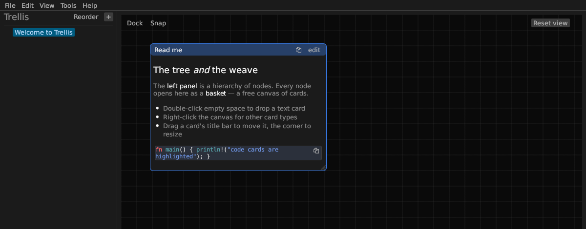

# Trellis

A hierarchical, spatial note-taking app for the desktop, written in Rust.

Two proven ideas, woven together:

- **The tree** — an outliner-style hierarchy of nodes for structure and navigation.
- **The basket** — each node's body is not a linear document but a free-form
  2-D canvas where you drop, drag, resize, and arrange rich cards.

Structure lives in the tree; spatial thinking lives in the basket. A trellis is
a lattice that supports branching growth — the tree *and* the weave in one.



## Features

**Tree**
- Add root / child / sibling nodes; inline rename (double-click); delete subtrees
- Reorder siblings (move up/down), indent / outdent to reshape the hierarchy
- Expand / collapse; right-click → **Expand all** / **Collapse all** to open or
  fold a whole branch at once for working with big node sets
- Per-node color tags and a per-node **basket background color** (right-click →
  **Basket color**; the black grid stays the default)
- Right-click → **Copy** a node's **id** (for the agent API, `/api/nodes/{id}`)
  or its **path** breadcrumb, so you can point an agent at the exact node

**Basket canvas** — six real card types:
- **Text** — CommonMark markdown, rendered live, with edit/preview toggle. Fenced
  code blocks are syntax-highlighted. The editor has a formatting toolbar (bold,
  italic, headings, lists, quotes, code, links, rules), a **text color** picker
  whose color shows live in the rendered card, a **font-size** selector
  (75%–200%, per card), and **auto-continuing lists** (Enter adds the next
  `-`/`1.`/`- [ ]` marker; empty item ends the list). **Drag an image onto a
  text card** (or right-click in edit mode) to embed it **inline** in the body;
  it exports as a data URI in HTML/Markdown and shows on the card's PDF page.
- **Code** — dedicated code editor with a language selector and highlighting.
- **Checklist** — real checkboxes with add/remove/edit per item; drag the grip
  to reorder items.
- **Table** — a small spreadsheet: inline cell editing, insert/delete/resize
  rows and columns (right-click the row/column handles), per-cell **background
  and font colors**, an optional header row, and **CSV/XLSX import & export**
  (XLSX export keeps your colors). The copy button copies the table as CSV, and
  **right-click any cell** to copy that **cell, row or column** — to both the
  clipboard and the X11 primary selection, so middle-click paste works too.
  While editing, selecting text in a cell offers it to other apps and
  middle-click pastes into it, the same as a text card. Turn one
  into a **chart** (bar, line, scatter or **pie**) from the table's toolbar — the cells stay
  the data, so editing one redraws the chart, and you can keep the grid visible
  underneath. Non-numeric cells are gaps, not zeros, so a blank never plots as a
  measured 0.
- **Sketch** — a freehand draw surface: pick a **brush color and size**, draw
  with the mouse/pen, **undo the last stroke** or **clear**. Strokes are vector
  (they scale with zoom and export to HTML as inline SVG).
- **Image** — hold **any number of images** (bytes embedded), laid out in a
  grid; give the card a **title** to tell a few apart. **Double-click an image**
  to open it in a full-screen viewer — scroll or `+`/`-` to zoom, drag to pan,
  `←`/`→` (keys or buttons) to flip through the card's images, Esc to close.
  Right-click an image to remove it. **Right-click the card → Extract text (OCR)**
  reads the text out of the image(s) with tesseract so the card becomes
  full-text searchable. **Right-click → Download** saves an image back out to a
  file (or **All N images…** into a folder) to share or reuse.

Cards drag by the title bar, resize from the corner, raise to front on click,
duplicate, recolor, copy/paste into another basket, and delete. Right-click →
**Export Card** saves just that card to share — **PNG** or **PDF** (a WYSIWYG
snapshot of the card exactly as it looks on screen), **Markdown**, **HTML**,
**plain text**, or a portable **JSON card file** for any card, plus **CSV/XLSX**
for tables and **SVG** for sketches. Bring a card in with right-click canvas →
**Import card…** or by **dragging a JSON card file** onto the canvas. A 🗐 button on
the title bar copies the card's text (checklists as Markdown task lines) to
both the clipboard and the X11 primary selection. Right-click → **Copy** →
**Card id** / **Card path** copies the card's identifier or breadcrumb, so you
can point an agent at that exact card. The canvas pans
and zooms (Ctrl+scroll); each node remembers its view. A **minimap** in the
bottom-right corner (toggle in **Settings → Canvas**) shows the whole basket at a
glance with a reticle for your current view — so you can spot cards that sit far
from the main cluster, and click or drag on it to jump there without zooming out.

**Organizing cards**
- **Group** — Ctrl/Cmd+click cards to multi-select, then "Group N cards" wraps
  them in a labeled container you drag as one; right-click the header to rename,
  recolor, or ungroup. **Click a group's header to raise the whole group to the
  front** — the header stays grabbable even when other cards pile on top of it.
- **Dock** (toggle) — drag one card onto another to stick them so they move
  together; drag a docked card off to detach.
- **Snap** (toggle) — a dragged card's edges snap to nearby cards' edges, with a
  guide line.
- **Autosort** — **Tools → Autosort cards** first **auto-sizes** every card to fit
  its content, then lays the whole basket out in a tidy, non-overlapping grid.
- **Fit to content** — right-click a card → **Fit to content** resizes just that card
  so its text/items/table are fully readable (no more unreadable little squares). Agents
  get the same via `"fit": true` on card create/update, and it gives the identical
  size either way. Text is measured as it actually renders — a Markdown heading is
  taller than body text, and a long note is sized to fit rather than cut off.
- **Templates** — right-click a card → **Save as template** to reuse a card you make often
  (e.g. a *Today's Todos* checklist); right-click the canvas → **Insert template** to drop a
  fresh copy at the click point. Saving a template also puts a **master card** for it in a
  root-level **Templates** basket (created the first time), so your templates are something
  you can see and edit rather than an invisible setting: tweak the master, right-click →
  **Update template**, and every later copy you stamp uses the new version. Deleting a
  template removes its master too, and **Tools → Rebuild Templates basket** fills in masters
  for templates saved before the basket existed. Templates persist across restarts; they're
  stored with the app's settings rather than in the document, so each instance (see
  [Separate documents](#separate-documents-side-by-side)) has its **own** template list and
  its own Templates basket.

**Documents & interop**
- **Drag & drop** text/Markdown or image files onto a basket to create the
  matching card at the drop point
- Native New / Open / Save / Save As. **Autosave** (Tools → Settings → Document,
  on by default) writes changes a couple of seconds after you pause, like Google
  Docs — debounced, atomic (temp file + rename), and run on a background thread so
  it never freezes the UI. Files are **gzip-compressed** (RON format, `.ron`;
  image-heavy documents shrink dramatically) and older plain-text `.ron` files
  still open.
- **Mirror a file in a card** — right-click a text or code card → **Mirror a
  file…** to show a file's contents live, refreshed while the document is open.
  Useful for a README, a config or a spec you want *beside* your notes rather
  than copied into them: the file stays authoritative and the card is read-only
  until you **Stop mirroring** (which keeps the text). The mirrored text is
  searchable and exports like any other card. Agents get the same via `source`
  on card create/PATCH. **A table card can mirror a CSV/TSV** — the file fills its
  cells, so you get live data with real cell colours and column widths, and
  **conditional formatting** can colour a column by value (over 1000 → red, and
  so on). Refreshes keep your widths and colours. *Note: a card can mirror any
  file you can read, so treat the API key as equivalent to filesystem read
  access — see [API.md](API.md).*
- **Snip to card** (Tools → Snip to card) — capture a screen region straight
  into an image card in the current basket. **OCR all images** (Tools) extracts
  text from every image card that lacks it, making old scans searchable.
- **Backup** (**Tools → Backup…**) — scheduled, full-document backups to
  external locations (this is backup, *not* version history: each run writes a
  complete, self-contained copy). Destinations: **Disk** (a local/mounted
  folder), **Network (SFTP)** via `scp`, and **Cloud** via `rclone` (S3, Google
  Drive, Dropbox, B2, …). Optional **encryption** with `gpg` symmetric AES-256.
  Set an interval and a per-disk retention count; it runs on a background thread
  so a slow target never freezes the app. Restore with
  `gpg -d file.ron.gz.gpg > file.ron.gz` (if encrypted), then open the `.ron.gz`.
  Backup settings are per instance and back up the document that instance has
  open, so configure them once per document.
- **Version history** (**Tools → Version history**) — automatic timestamped
  snapshots taken as you save (in a hidden `.<name>.history/` folder beside the
  document, so each document has its own); browse and **Restore** an older
  version. A local safety net, separate from Backup. Edits made over the agent
  API are snapshotted the same way. **How many to keep and how far apart** are
  in **Settings → Version history** (25 snapshots, 3 minutes apart by default) —
  each one is a full copy of the document, so a large document is happier with
  fewer, spaced wider. No snapshot is taken when you close the app, which keeps
  closing quick; the document itself is saved either way.
- **File → Export** the whole tree as **Markdown**, styled **HTML**, **JSON**,
  **PDF** (paginated A4), or a **PNG/GIF** image
- **File → Import** **Markdown**/**HTML** as a new node, or a **JSON**-exported document
- **Export / import a single basket** — right-click a tree node → **Export basket** (its
  cards) or **Export basket + subnodes** (the whole subtree) as **Markdown / HTML / JSON**,
  and **Import basket…** to bring a JSON basket file back in as a child node. Share one
  day's notes without handing over the whole archive. Also **PDF (visual)** — a whole-basket
  overview page then a readable WYSIWYG page per card, each with selectable/searchable text —
  and **PNG (overview)**, a single image of the basket as arranged.

**App**
- Full-text **search** across every node title and card (Ctrl+F). Clicking a
  result reveals the matching card — the canvas recenters on it and it flashes
  briefly — not just its basket. The **Find**, **Tags**, and **Backlinks** panels
  reveal the clicked card the same way.
- **Quick switcher** (Ctrl+O) — fuzzy-jump to any node by title or path; Enter
  opens it, expanding its ancestors and scrolling it into view. Fast navigation
  for a deep tree.
- **#tags** (View → Tags) — write `#tags` in any card and browse them
  document-wide: the Tags panel lists every tag with a count; click one to see
  (and jump to) the cards that use it. Nested tags like `#work/urgent` work.
- **Properties** — inline `key:: value` fields in a card (e.g. `due:: 2026-08-15`,
  `status:: open`) are parsed as metadata you can query across the tree.
- **Find cards** (View → Find cards) — a cross-tree query panel: pick a tag and/or
  a property (+ value) from dropdowns, optionally add text; results link back to
  their basket. No syntax to remember.
- The **Agenda** and the **Kanban board** can each be **filtered to one project**
  (the dropdown at the top),
  and every row is colour-coded by project — the project's own colour tag when it
  has one, otherwise a stable colour picked for it — so a long list groups by
  project at a glance. Kanban cards are colour-coded the same way. Each view
  remembers its own filter between launches — they answer different questions, so
  you can scope them differently.
- Both the **Agenda** and the **Kanban board** show each task's **full basket
  path** (`Super Weapon News › Open Items`), not just the basket name — project
  folders reuse names like "Open Items", so the bare name can't tell you which
  project a task belongs to.
- **Task agenda** (View → Agenda) — every card with a `due:: <date>` becomes a
  task, grouped **Overdue / Today / This week / Later** across all baskets. Click
  a task to jump **straight to that card** — the basket recenters on it and it
  flashes briefly so you can't lose it. A task is done when it has `status:: done`
  (or its checklist is fully checked). Track deadlines that span workspaces
  without copying cards around.
- **Wiki-links & backlinks** — write `[[Node Title]]` in a card to make a
  clickable link that jumps to that node — in the card itself as well as in the
  Backlinks panel; **View → Backlinks** shows everything that links to the
  current node ("linked here").
- **Link graph** (View → Link graph) — a force-directed picture of the wiki-link
  web across the tree; click a node to open it.
- **Kanban board** (View → Kanban board) — cards with a `status::` property shown
  as columns (To do / Doing / Done, plus any custom status) that divide the window
  width and each scroll their own cards. Every card shows its accent color, its
  `due::` date (red when overdue), and its `#tags`. Drag a card between columns to
  change its status, or click one to jump straight to it on its basket; toggle
  **Show done** to hide the finished pile. Reads the same properties as the agenda.
- **View → Themes** — Trellis (default), Light, Terminal Green, **Sticky Notes**
  (solid single-color paper cards — yellow by default, the whole note takes the
  color you give it — on a cork board), **Futuristic** (a Minority-Report teal HUD
  with beveled tech-panel cards), or **SynthWave** (a dark, near-black
  Hotline-Miami interface with hot pink + electric cyan used only as *accents*).
  The two neon themes draw a soft accent **glow** behind each card.
- **Zoom** the whole UI (Ctrl+`+` / Ctrl+`-` / Ctrl+`0`)
- **Agent API** — a key-gated HTTP API (localhost by default; opt-in **LAN
  access** in Settings for phones/other devices) with full parity to the app:
  add/query/edit/remove nodes and cards, move/recolor/resize, convert a card's
  kind, edit tables cell-by-cell (colors, headers, rows/cols, **autofit column
  widths**), upload images
  (incl. inline images in text cards), build groups, join/leave and dock cards,
  **reorder and reparent nodes** (`/nodes/{id}/move`), **reorder cards** within a
  basket (`/cards/{cid}/move`), **expand/collapse** subtrees, query the tree by
  `#tags` / `key:: value` properties / due-date **agenda** (`/tasks`) / **Kanban**
  columns (`/kanban`) / wiki-link **graph**, register · insert · **update**
  reusable card **templates**, trigger a **backup**, and export the document
  (incl. PDF/PNG) — so agents can collaborate on the same notes. **Live updates:**
  `GET /api/wait` long-polls so clients react the instant anything changes, and
  `GET /api/changes` says **what** changed — which card, who changed it, which
  fields, and the `key:: value` if a property moved — so a client re-reads one
  card instead of the whole document. An instance serves one document, so **the port
  addresses the document** — `GET /api/instance` reports which one is open, and
  edits are autosaved a couple of seconds later without anyone pressing Save.
  Enable it in **Tools → Settings**, where **Examples** gives you copy-paste
  `curl` commands already filled in with this instance's host, port and key; see
  [API.md](API.md).
- **Agent tokens** (**Tools → Settings → Agent API**) — give each agent on your
  network a credential of its own instead of handing out the instance key. Name
  the token after the agent, and Trellis will make it a basket of that name and
  confine it there: it can read and write its own workspace and **nothing else**
  in the document. Optionally read-only. Revoking one takes effect immediately
  and leaves every other client working — which the instance key cannot do, since
  regenerating it breaks them all at once.

  The confinement is enforced on the way in, not asked for politely: a request
  naming a basket outside the token's scope is refused, and so is one that names
  no basket at all — which includes search, the agenda and the Kanban board,
  because those read the whole document. An agent that needs those needs
  whole-document access, and that is a different decision.
- **Plugins** (**Tools → Plugins…**) — third-party integrations that are *not*
  Trellis code. A plugin is a separate program Trellis launches, which talks back
  over the same agent API; because it runs out-of-process, one that crashes can't
  damage your document. Each plugin **declares what access it needs** and Trellis
  states it in plain words — *"wants to read your whole Personal.ron document"* —
  before you approve it. You approve a **scope**, once: Trellis mints and stores
  the token itself, so there is no credential to copy, paste or rotate, and
  **Revoke** stops it working immediately. A read-only plugin is enforced as
  read-only by the API, not merely asked to behave. Plugins run from Tools →
  Plugins, from a basket's or a **card's** right-click menu, on a schedule, or
  when the document changes; they live per instance (see
  [Separate documents](#separate-documents-side-by-side)). A running plugin
  shows **live progress** — a bar when it reports a percentage, its latest line
  otherwise — and a **Cancel** button that stops it and everything it started.
  Worked example:
  [`plugins/dry-backup/`](plugins/dry-backup/README.md), which copies a document
  into a [Dry](https://dry.ai) space and can be re-run without duplicating, and
  can **publish a single card at a public link** from its right-click menu — it
  fetches that link with no credentials before handing it to you, so a link that
  only works for you is an error rather than something you find out after
  sending it to someone.
- **Web clipper** — a small Chrome/Edge extension (`web-clipper/`) clips the
  current page or your text selection into a Trellis basket over the LAN API.
- **Companion mobile app** — a native Android viewer/capture app talks to the
  agent API over the LAN: browse the tree and baskets, full-text search, zoom
  images, capture a note or photo into a node, and read-only **Agenda** and
  **Kanban** task views — all updating live, and with an **offline** cache so a
  document you've opened stays readable when the desktop is unreachable. Separate
  repo: [trellis-android](https://github.com/PortableDiag/trellis-android).


**Daily notes — opt-in, and off until you say so.** Choose a *journal root* in
**Tools → Settings → Daily notes** and **Ctrl+T** opens today's node, creating
`<root> → <month> → <day>` only as far as it needs to. A day already in the tree
is *adopted, not duplicated* — the date is matched by parsing the title, so a
journal you have kept by hand (`8/11/2026` next to `6/09/2026`, a misspelled
weekday) keeps working untouched. A new year becomes a sibling of the old root
rather than nesting inside it. **Nothing dated is ever created any other way**,
and the setting belongs to that instance, so a work document can keep a journal
while a personal one never grows one. Agents get the same thing at
`POST /api/daily`.

**Today's note is a journal, not a task list.** A task is one card carrying
`status::` and `due::` that stays in its own basket; the **Agenda** and **Kanban**
gather them across the whole document, which is what replaces a list copied from
day to day.

## Keyboard

| Shortcut | Action |
|---|---|
| Ctrl+Z / Ctrl+Shift+Z | Undo / redo canvas edits (moves, autosort, …) |
| Ctrl+S | Save |
| Ctrl+F | Toggle search |
| Ctrl+O | Go to node **or card** — fuzzy by title/path, or exact by id (`1391`, `#1391`) |
| Ctrl+T | Today's note (only when daily notes are switched on) |
| Ctrl+N | New document |
| Ctrl+`+` / `-` / `0` | Zoom in / out / reset |
| Ctrl+scroll | Zoom (toggle in Settings; on by default) |

## Download

Every [release](https://github.com/PortableDiag/trellis/releases) attaches a
ready-to-run build. There is nothing to install alongside it — the fonts and
icon are compiled in.

| Platform | File |
|---|---|
| Linux (x86_64) | `trellis-<version>-linux-x86_64` |
| Windows (x86_64) | `trellis-<version>-windows-x86_64.exe` |
| macOS (Apple silicon **and** Intel) | `Trellis-<version>-macos-universal.app.zip`, or the bare `trellis-<version>-macos-universal` for the command line |

**The Windows and macOS builds are unsigned**, because signing them means paying
Microsoft and Apple for certificates. That is visible the first time you run one:

- **Windows** — SmartScreen shows "Windows protected your PC". *More info* →
  *Run anyway*.
- **macOS** — Gatekeeper refuses to open it at all. Right-click the app →
  **Open** (which offers the choice the double-click doesn't), or run
  `xattr -d com.apple.quarantine /Applications/Trellis.app` once.

On Linux, `chmod +x` the file and run it.

## Build & run

```sh
cargo run --release
```

Any recent stable Rust toolchain, on any of the three platforms. Building on a
fresh Linux box also wants the X11/Wayland headers egui links against:

```sh
sudo apt install libxcb-render0-dev libxcb-shape0-dev libxcb-xfixes0-dev \
                 libxkbcommon-dev libwayland-dev
```

Releases are built by [`.github/workflows/release.yml`](.github/workflows/release.yml)
on native runners for each platform, triggered by pushing a `vX.Y.Z` tag.

### Command line

```
trellis [FILE] [-p|--port PORT] [-d|--data-dir DIR]
```

`FILE` is the document to open (a path that doesn't exist yet starts a new
document saved there). `--port` sets the agent API port for that run, and
`--data-dir` gives the instance its **own settings** — API key, port, theme,
backup config and autosave slot — under that directory. `trellis --help` for the
full text; with no arguments Trellis reopens the last document as before.

### Separate documents, side by side

One instance serves one document, so run **an instance per document** and give
each its own port and data directory:

```sh
trellis ~/work.ron     --port 7373 --data-dir ~/.local/share/trellis-work
trellis ~/personal.ron --port 7374 --data-dir ~/.local/share/trellis-personal
```

They keep separate settings, separate version history and separate backups, and
the window title shows which document each one has open.
For agents, **the port is the document's address** — `GET /api/instance` reports
which document a port is serving, so a script can check before it writes. Keeping
work and personal notes in different documents also means an agent pointed at one
can't read or rewrite the other.

Tests: `cargo test` (binary crate — use `cargo test --bin trellis` to test a
single target).

### Optional external tools

A handful of features shell out to a command-line tool. **None of them is
required** — a missing tool disables exactly one feature and nothing else, and
never crashes the app.

**Tools → Requirements…** lists all of them with what each one enables and
whether it's installed, and gets you the missing ones: it runs the install for
you where the platform has a package manager it can drive (**winget** on
Windows, **Homebrew** on macOS), and hands you the exact command otherwise —
installing on Linux needs a root password, which the app deliberately doesn't
ask for.

| Tool | Enables |
|---|---|
| `tesseract` | OCR — extract text from image cards so scans and screenshots are searchable |
| `gpg` | Encrypted backups (AES-256) |
| `rclone` | Cloud backup destinations (S3, Drive, Dropbox, B2…) |
| `scp` | SFTP backup destinations — ships with macOS, Linux and Windows 10+ |
| `xclip` / `xsel` | Linux only: middle-click paste and the X11 primary selection |
| `maim` / `scrot` / `spectacle` / … | Linux only: **Snip to card**. macOS and Windows use the region capture built into the OS |

The markdown renderer (`egui_commonmark`) is vendored under `vendor/` and patched
to render inline text-color spans; edit it there, not the crates.io copy.

## Docs

- [API.md](API.md) — the localhost agent HTTP API.
- [web-clipper/README.md](web-clipper/README.md) — the Chrome/Edge clipper extension.
- [plugins/dry-backup/README.md](plugins/dry-backup/README.md) — the Dry backup
  plugin, and the plugin contract it demonstrates.
- [docs/VR-PROPOSAL.md](docs/VR-PROPOSAL.md) — proposal for a VR client (separate
  side project; talks to the agent API rather than embedding the desktop app).
- [CHANGELOG.md](CHANGELOG.md) — version history.
- `trellis --help` — command-line arguments (document, port, data directory).

## License

MIT. Vendored `egui_commonmark` / `egui_commonmark_backend` are MIT/Apache-2.0
(see `vendor/*/LICENSE-MIT`).
